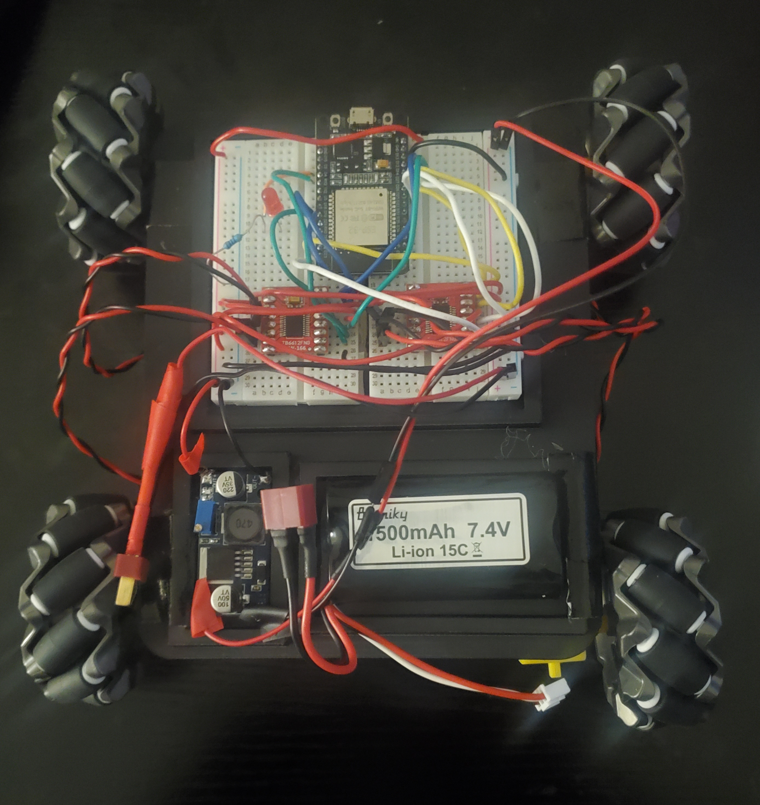

# Alphanso Rover

Alphanso is first robot I designed and created on my own (hence the name). Alphanso has a 4-wheel mecanum drivetrain and is controlled via bluetooth using a PS4 controller. I later plan to create another rover with more features, but I consider this project very successful for a first attempt.

## Setup

The chassis for Alphanso was 3D printed. Since it's wide and flat, it would have made more sense to cut it out of another material, but I didn't have any of the necessary tools on hand. The CAD model for the chassis is available on Onshape [here](https://cad.onshape.com/documents/276a8e7378f0b6225af4305d/w/07466e83f2c78b557cda318c/e/847e4e1f577a4bce06d5f762?renderMode=0&uiState=6a31f9fdfc247f6640c2fb50).

### Bill of Materials

| Part                                  | Count |
| ------------------------------------- | ----- |
| DOIT-ESP32-DEVKIT_V1 Board            | 1     |
| Half-sized Breadboard                 | 2     |
| 7.4 V Li-ion Battery                  | 1     |
| T-Plug Connector                      | 1     |
| LM2596 Buck Converter Module          | 1     |
| TB6612FNG Motor Driver Breakout Board | 2     |
| TT Motor                              | 4     |
| Mecanum Wheel (2 Left and 2 Right)    | 4     |
| PS4 Controller                        | 1     |

_Note: This board is a bit too wide for a standard breadboard, so it's necessary to connect two breadboards together in such a way that there is only one column of pins exposed on each side._

### Wiring

A schematic can be found [here](./schematic/alphanso-rover.pdf). The image below is a reference and not intented to be used as a wiring diagram.

### Programming

The full source code can be found in [main.cpp](./src/main.cpp). The code has one dependency: [PS4Controller](https://github.com/aed3/PS4-esp32). This project was developed using Platformio, so it will be easiest use an IDE with the Platformio extension installed to upload the code to your board. You could also install the library using the Arduino IDE and upload the code that way.

You need to change the `PS4_MAC_ADDRESS` variable to match the bluetooth MAC address of the device the controller is paired with. I did this by pairing the controller to my laptop and using my laptop's address, but you should also be able to use the PS4 address directly. Just make sure that controller isn't paired to anything. 

### Control

The left joystick is used for translation, where the side opposite the battery indicates the front. The right joystick is used for rotation, where left is CCW rotation and right is CW rotation. The status LED will blink until the controller is connected, at which point it will turn solid.
